# July Oven card guide

A walkthrough of the **July Oven** dashboard card, with pictures of every screen. It shows
card 0.5.12. For the full option list, see
[July Oven dashboard card](../../README.md#july-oven-dashboard-card) in the main README.

The pictures come from the card's test page (`tests/card/index.html`), using a mock oven. The
camera picture of a tray of cookies is an illustration.

<p align="center"></p>

- [Set up](#set-up)
- [Home screen](#home-screen)
- [Start a cook](#start-a-cook)
- [While it cooks](#while-it-cooks)
- [Camera](#camera)
- [History](#history)
- [Several ovens](#several-ovens)
- [Settings](#settings)
- [Sizes and looks](#sizes-and-looks)
- [Help](#help)

## Set up

The card ships inside the June Oven integration. Once the integration is installed, the card is
already loaded on every dashboard.

1. **Install the integration.** In HACS, add the custom repository `prj-july/ha-june-oven` as an
   Integration, open **June Oven** and select **Download**. See
   [Installation](../../README.md#installation).
2. **Restart Home Assistant**, then pair the oven from **Settings › Devices & services**. See
   [Pairing the oven](../../README.md#pairing-the-oven).
3. **Add the card.** Edit a dashboard, select **Add card** and search for **July Oven**. Pick your
   oven and an icon.
4. **Allow remote start.** On the oven itself, open **Settings › App permissions** so the card can
   start cooks.

In YAML, one line is enough:

```yaml
type: custom:july-oven-card
entity: climate.kitchen_oven
icon: kitchen            # optional
```

> [!WARNING]
> Don't add a `/local/` copy of the card as a dashboard resource. The integration serves the card
> and loads it for you, and an extra copy can load first and show an older version. To update:
> **HACS › Redownload**, restart Home Assistant, then hard-refresh the browser tab. The card's
> version shows at the bottom of its Settings.

## Home screen

When the oven is off, the card shows the oven's own home screen: a clock and pages of cook modes,
laid out and drawn like the tiles on the oven's touchscreen.

- **The oven's icon is its lamp:** orange while the oven heats, white while it's off. Tap it for
  the oven menu.
- **Clock:** 12 or 24 hour follows your language, or set it in Settings.
- **Cook mode tiles** are drawn the way the oven draws them: the glow lines show the heating
  elements (bottom for Bake, top for Broil, both for Roast), a fan for Air fry, waves for Reheat.
- **More pages:** swipe, or tap a dot. Page 2 holds Proof, Keep warm, Dehydrate, and the
  **Camera**, **History** and **Settings** tiles.

<table>
<tr>
<td width="50%">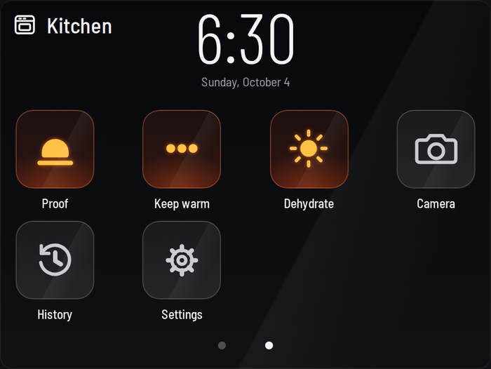</td>
<td width="50%">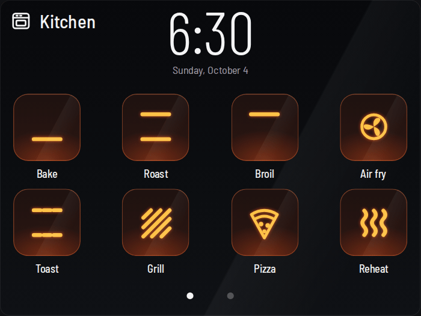</td>
</tr>
<tr>
<td><b>Page 2.</b> The last three modes, then Camera, History and Settings.</td>
<td><b>Back to page 1 on its own.</b> Left alone for 45 seconds on a later page, the home screen glides back to the first one. Any touch stops it. (The wait is cut short here.)</td>
</tr>
</table>

<table>
<tr>
<td width="50%">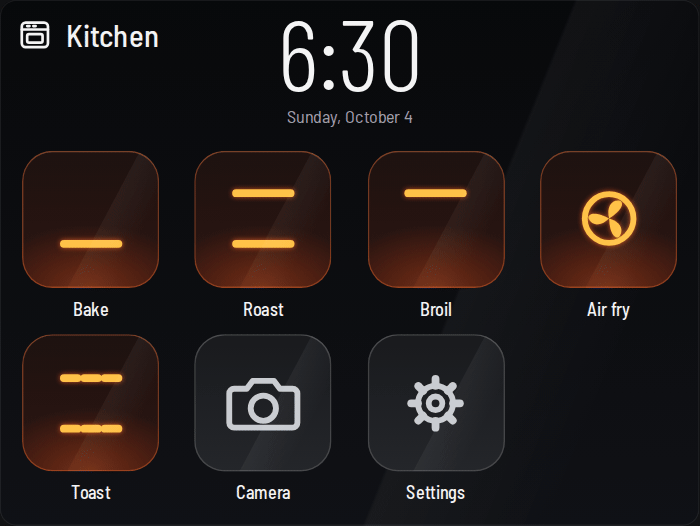</td>
<td width="50%">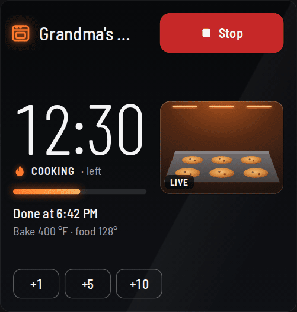</td>
</tr>
<tr>
<td><b>The name tucks away.</b> Five seconds after the home screen appears, the name slides into the icon to give the clock room. Hover over the icon to bring it back.</td>
<td><b>Long names scroll.</b> During a cook the name always shows. If it's too long to fit, hover over it and it scrolls.</td>
</tr>
</table>

<p align="center"></p>

Tiles answer the pointer: a tile's glow fades in on hover, and the Air fry fan spins up, then
eases to a stop when you move away.

The card can start **Bake, Roast, Broil, Air fry, Toast, Grill, Pizza, Reheat, Proof, Keep warm
and Dehydrate**. Slow cook still shows by name when you start it on the oven or in the June app.
Set **Cook modes** to **Most used first** in Settings to reorder the tiles by how
often you start each mode from the card.

## Start a cook

Nothing heats on one tap. Every mode opens a review first, and the oven only starts when you press
**Start preheating**. Every review has the same layout: the mode's tile on the left, one large
control in the middle with − and +, and a slider or a single line under it.

<p align="center">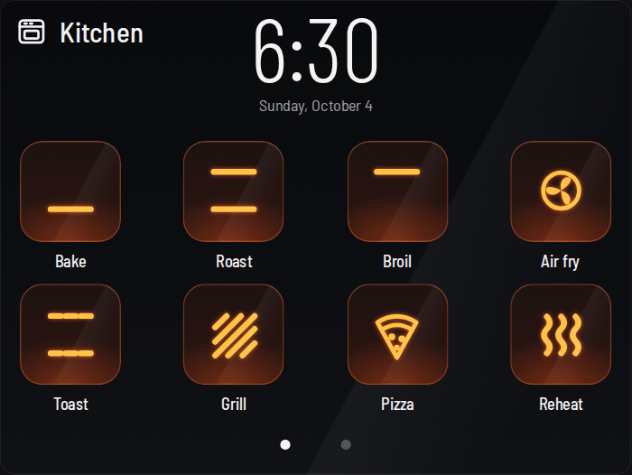</p>

- Drag the slider, or use **−** and **+**, or tap the number and type it. Enter confirms; Escape
  puts the old value back.
- Make sure the oven is empty and the door is closed. The card reminds you every time.
- The review closes itself after 5 minutes if you don't start, as the oven safety standard
  (UL 1026) asks. **Not now**, × or Escape closes it without changing anything.

| Toast | Reheat |
| --- | --- |
| 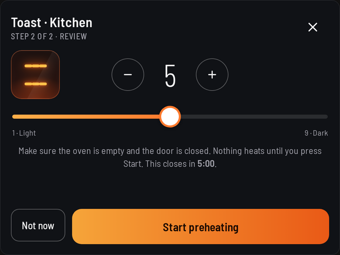 | 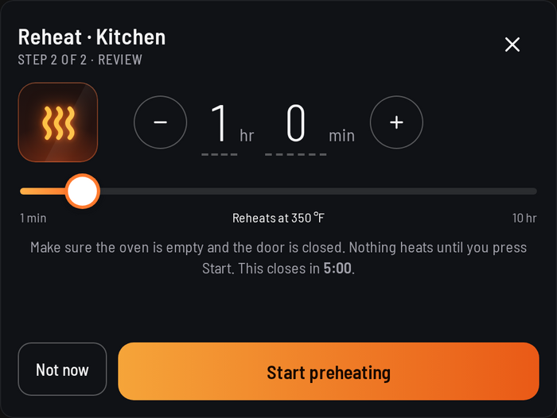 |
| A level from 1 (light) to 9 (dark) instead of a temperature. | A timer from 1 minute to 10 hours. Tap the hours or minutes to type them. |

| Grill | Pizza |
| --- | --- |
| 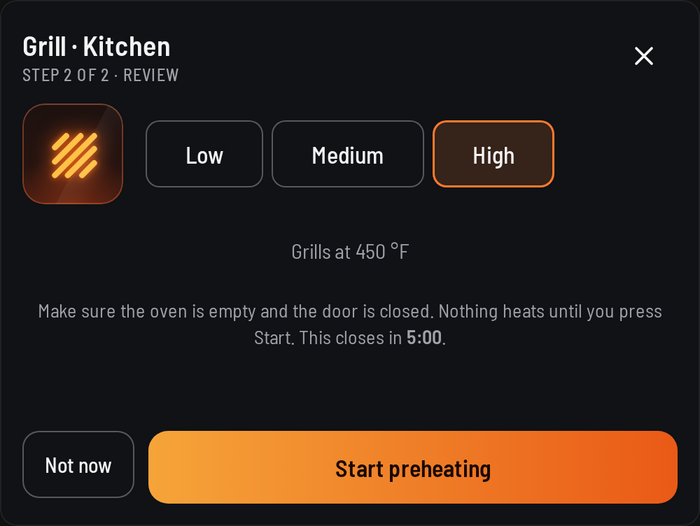 | 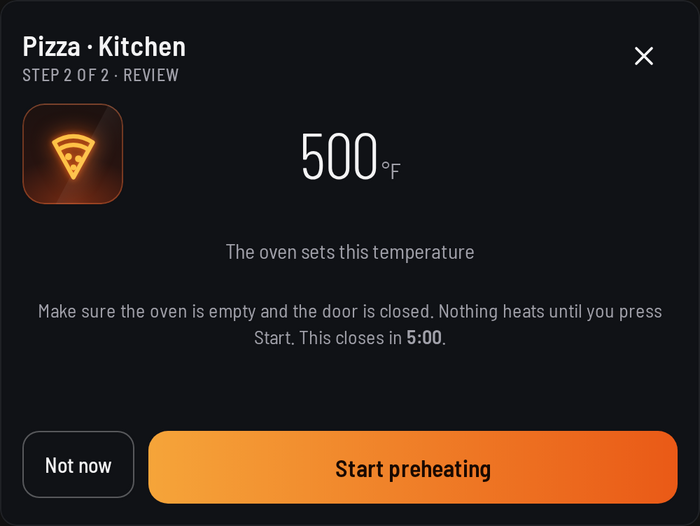 |
| Low, Medium or High, like the oven's own screen. | Runs at the temperature the oven sets. Proof and Dehydrate have their own temperature ranges. |

## While it cooks

One big number and one red Stop. Everything stays in the same place from preheat to done, so you
can read the card from across the kitchen.

<p align="center">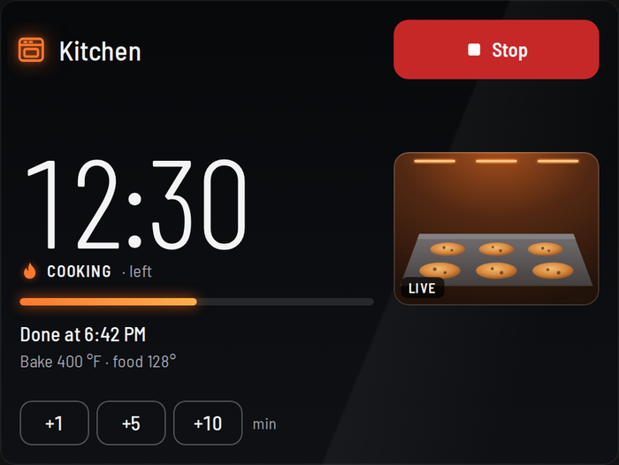</p>

- **Stop** is always top right, always red, and never asks "are you sure". With several ovens it
  names the oven it stops.
- **The big number** is the time left while a timer runs; otherwise the oven temperature, or the
  food temperature during a probe cook.
- **Status and progress:** a mark, a colour and a word (preheating, ready, cooking, done or
  offline), then when it will be done and the mode, set temperature and food temperature.
- **+1, +5 and +10 min** appear only while a timer runs.
- **Camera:** a new picture about once a second while the oven heats. Tap it for the camera window.

| Preheating | Ready | Probe cook |
| --- | --- | --- |
| 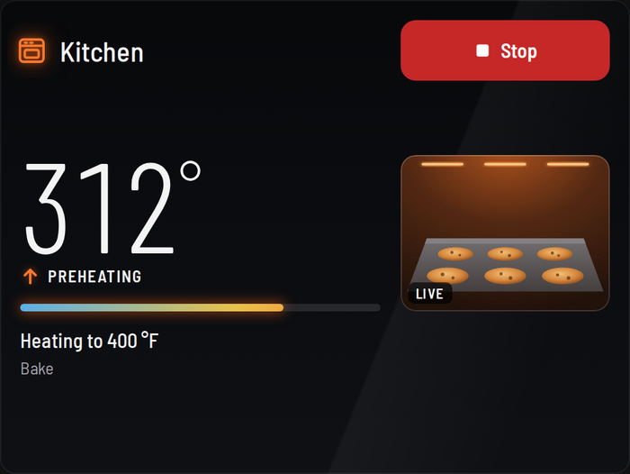 | 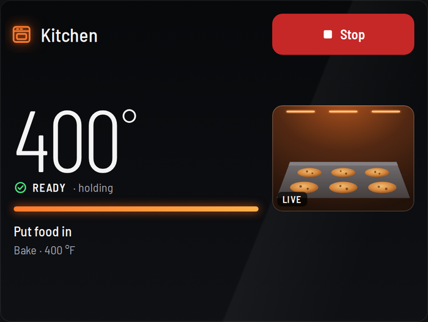 | 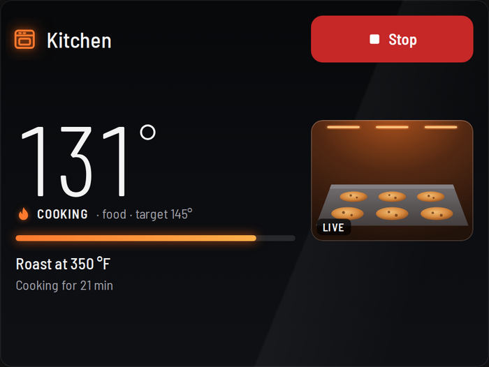 |
| The temperature climbs and the bar fills from blue to orange. | The mark turns green; put the food in. | The big number is the food temperature, with its target. |

| Done | Offline |
| --- | --- |
| 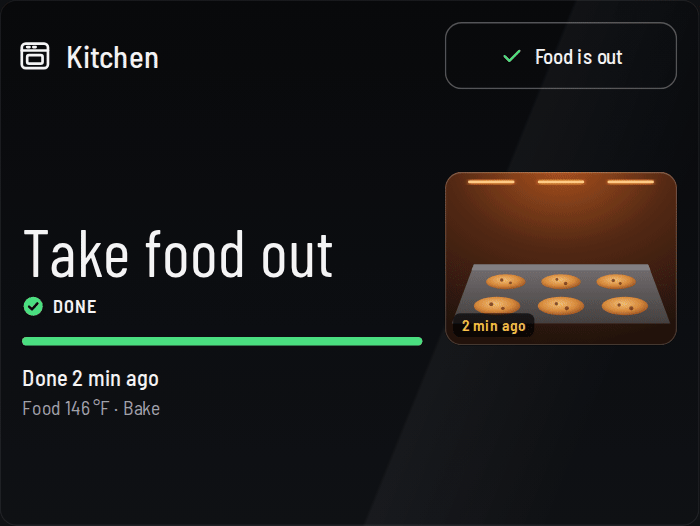 | 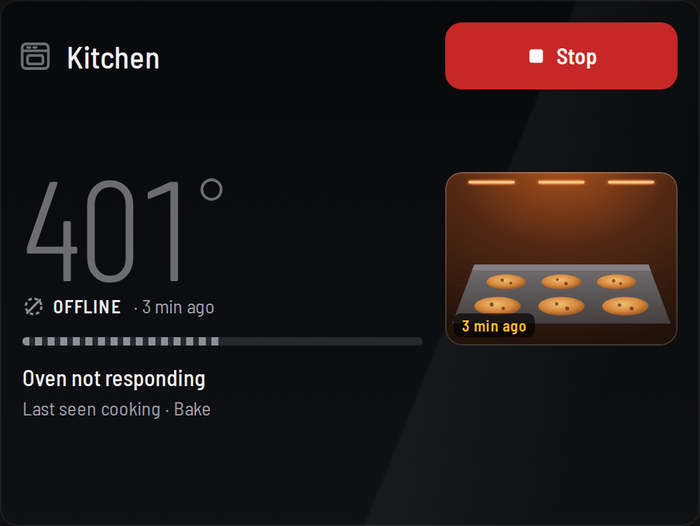 |
| **Take food out** shows for 30 minutes after the cook ends (on a wall tablet the graph stays up too). **Food is out** clears it, and the cook is saved in the [history](#history). | Home Assistant has lost touch with the oven. The last reading stays, greyed, with how long ago it was seen. |

## Camera

Tap the picture on the card, or the Camera tile on the home screen, and a larger camera window
opens over the card. × or Escape closes it.

<p align="center">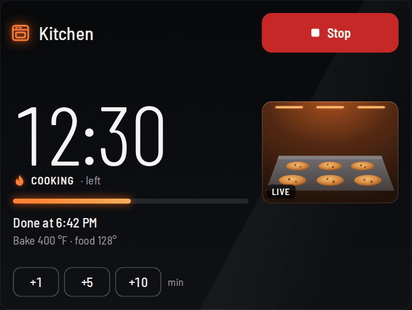</p>

- June's camera isn't a video stream. While it heats, the oven sends a still picture about once a
  second, and the card shows the newest one. The corner label shows **LIVE**, or how old the
  picture is.
- The window checks for new pictures at the **camera frame rate** you pick in Settings: 1, 5, 10 or
  15 per second. 15 is the default, so a new picture shows as soon as it arrives. 1 fps matches
  the stock June app and loads the fewest pictures from Home Assistant.
- With the oven on the Project July local server, opening the window while the oven is off wakes
  its camera, and it stays on while the window is open. Through June's cloud the camera only runs
  while the oven heats, and the window says **Camera off**.

## History

The integration records each cook when it ends, in Home Assistant, so it survives restarts and
every browser sees the same list. The **History** tile shows them, newest first, with each cook's
picture, target, time and result.

<p align="center">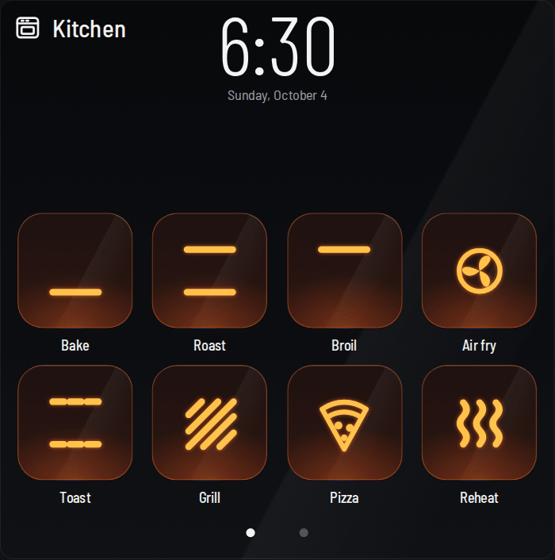</p>

<table>
<tr>
<td width="33%">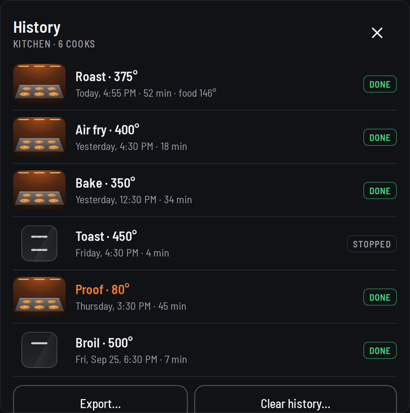</td>
<td width="33%">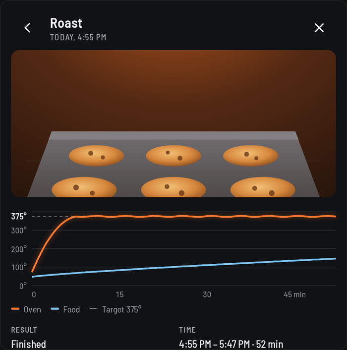</td>
<td width="33%">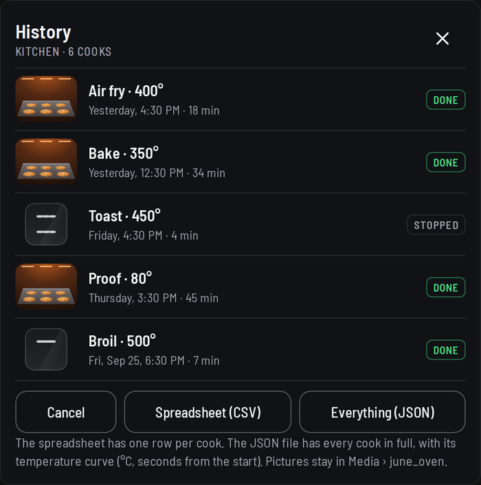</td>
</tr>
</table>

- Tap a cook for its last camera picture, its whole temperature curve (oven, and food from the June
  probe or the thermometer chosen under **Settings › Food probe**) and its details: result, time,
  length, target, hottest reading, preheat time and food temperature.
- **Export…** at the bottom of the list saves the history as a file: **Spreadsheet (CSV)** has one
  row per cook, **Everything (JSON)** has every cook in full with its temperature curve (°C, seconds
  from the start). Pictures stay in **Media › june_oven**.
- A single cook, or the whole history, can be deleted there. The integration keeps the newest 200
  cooks per oven; recording and pictures can each be turned off in the integration's options (see
  [Cook history](../../README.md#cook-history)).
- Each finished cook fires a `june_oven_cook_finished` event, for a cook log or a notification.

## Several ovens

Add more ovens to the same card. The oven that's heating gets the full card, other heating ovens
get a row with their own Stop, and ovens that are off share one row of small buttons.

<table>
<tr>
<td width="50%">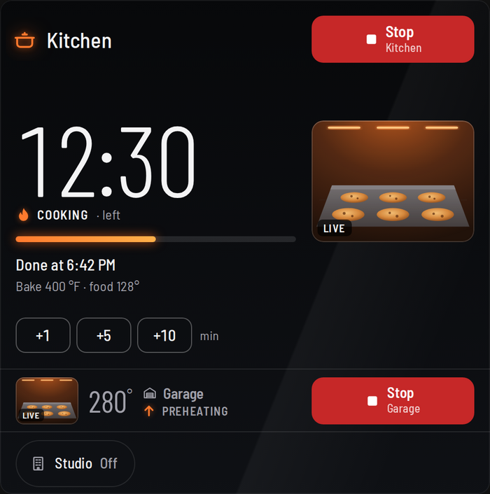</td>
<td width="50%">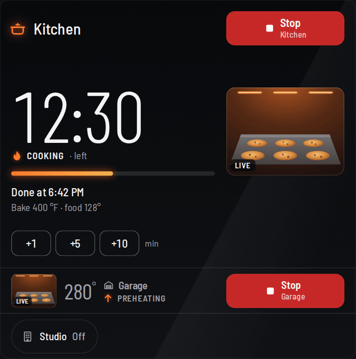</td>
</tr>
<tr>
<td><b>Three ovens at once.</b> Tap a row or button to show that oven in full.</td>
<td><b>The oven menu.</b> Tap the oven's icon for every June oven in Home Assistant. The card remembers your pick in this browser.</td>
</tr>
</table>

```yaml
type: custom:july-oven-card
entity: climate.kitchen_oven
icon: kitchen
entities:
  - entity: climate.garage_oven
    icon: garage
  - entity: climate.studio_oven
    icon: mdi:home-city
    name: Studio
```

## Settings

The Settings tile opens the card's own settings. Choices are saved in this browser, so a wall
tablet and your phone can each look the way you like. Your YAML is the starting point, and
**Reset** goes back to it.

<table>
<tr>
<td width="50%">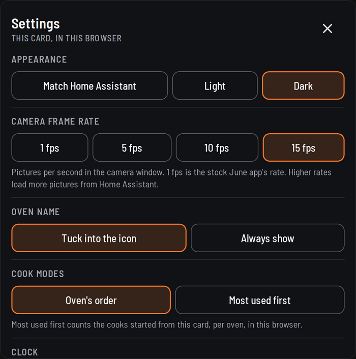</td>
<td width="50%">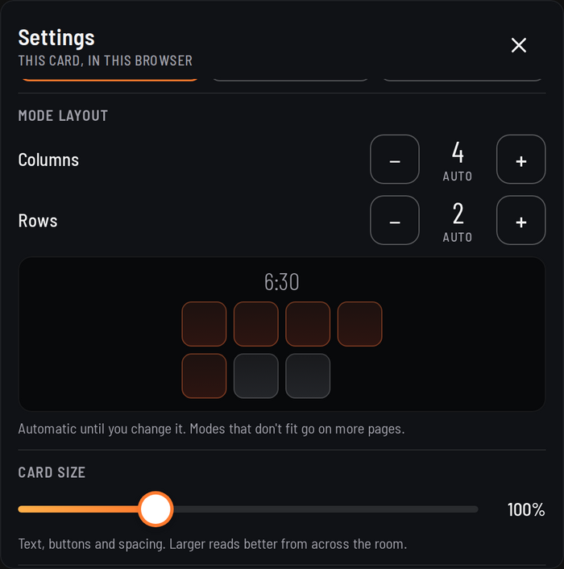</td>
</tr>
<tr>
<td width="50%">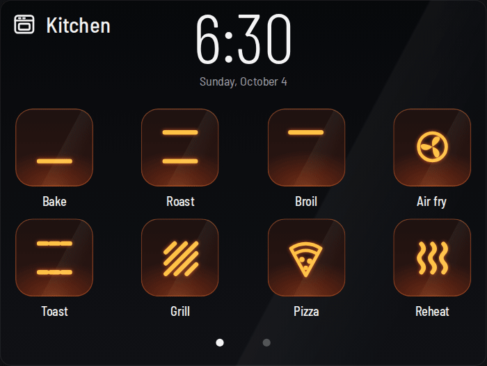</td>
<td width="50%"></td>
</tr>
<tr>
<td><b>Mode layout.</b> Seven columns and Fill icons fit all 14 tiles on one page. Modes that don't fit the grid go on more pages.</td>
<td><b>Oven icons.</b> One row per oven. Pick one of 12 icons or type any <code>mdi:</code> icon. The card's version is at the bottom.</td>
</tr>
</table>

<p align="center">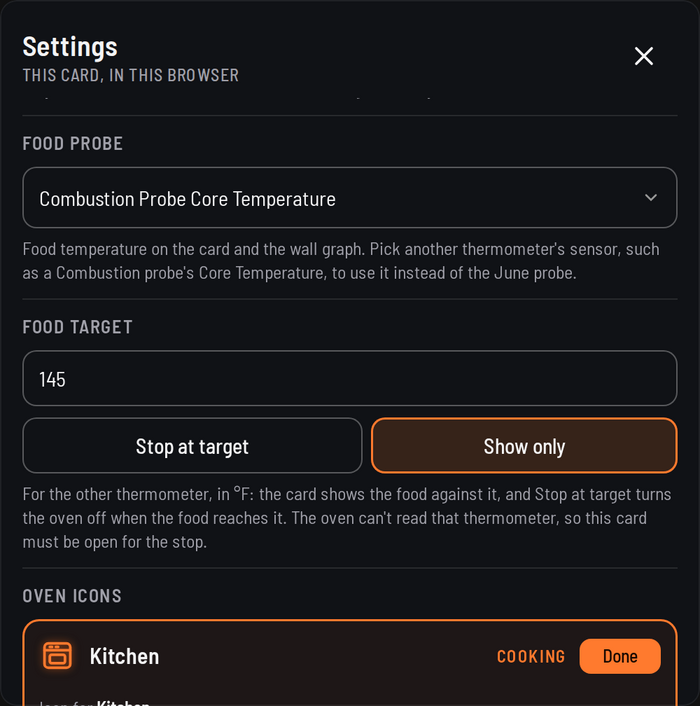</p>

**Food probe:** pick any Home Assistant temperature sensor to use instead of the June probe, such as
a [Combustion](https://github.com/legrego/homeassistant-combustion) probe's Core Temperature
(listed first). **Food target** sets its target; with **Stop at target** the card turns the oven
off when the food reaches it. The oven can't read that thermometer, so a card has to be open for
the stop to happen.

| Setting | Choices | YAML key |
| --- | --- | --- |
| Appearance | Dark (the default, the oven's own glass), Light, or Match Home Assistant | `theme` |
| Camera frame rate | 1, 5, 10 or 15 fps (default 15; 1 is the stock June app) | `camera_fps` |
| Oven name | Tuck into the icon after 5 s, or always show | `hide_name` |
| Cook modes | The oven's order, or most used first (counted per oven, in this browser) | `mode_order` |
| Mode layout | Columns 1–7 and rows 1–3, or automatic | `columns`, `rows` |
| Card size | 80–150%: text, buttons and spacing | `scale` |
| Mode icon size | Small, Medium, Large (default) or Fill | `icon_size` |
| Clock | Automatic, 12-hour or 24-hour | `clock` |
| Food probe | The June probe, or any temperature sensor, per oven | `probe` |
| Food target | The other thermometer's target, and Stop at target or Show only | `food_target`, `food_auto_stop` |
| Oven icons | 12 built-in icons or any `mdi:` icon, per oven | `icon` |
| Oven in Home Assistant | Opens the oven's device page | none |

## Sizes and looks

On a sections dashboard the card picks its layout from its size: standard is 12 × 6, wall tablet
is full width × 8, compact is 12 × 1, and each extra oven adds a row. In a panel view the card
fills the window. Set `display_mode` to choose one yourself.

<p align="center">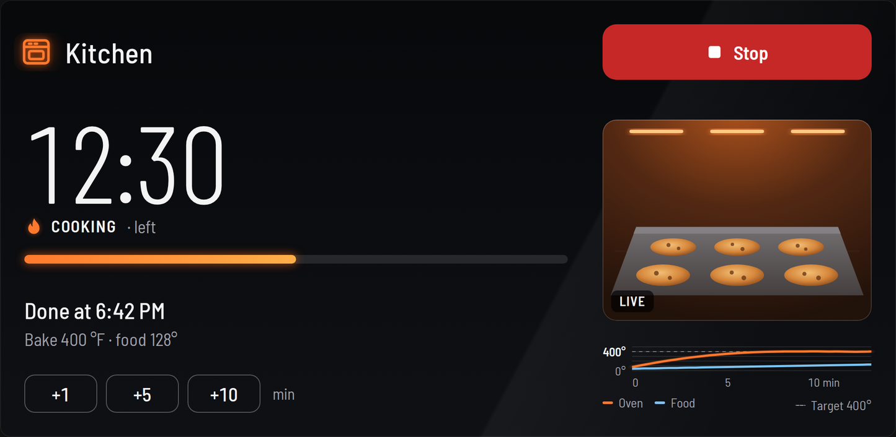</p>

**Wall tablet:** bigger type and more space, made to be read from across the room. Under the
camera, a graph shows the oven temperature and, with the probe in, the food temperature for this
cook (up to the last hour), with the target as a dashed line. Degrees run up the left with the
target in bold, and minutes since the start along the bottom. It stays up on the Done screen until
the food is out. It reads Home Assistant's history, so it needs the recorder; tap it for the full
history.

<p align="center">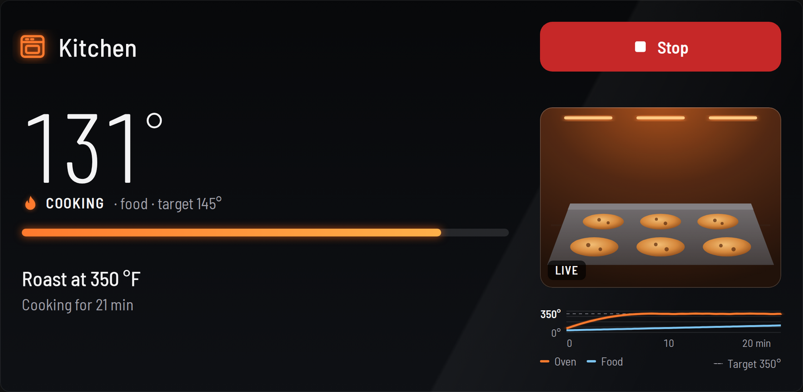</p>

**Compact, one row:**

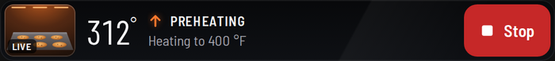
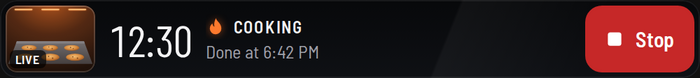
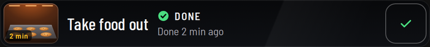

**Light look:** **Match Home Assistant** follows your dashboard theme instead.

<table>
<tr>
<td width="50%">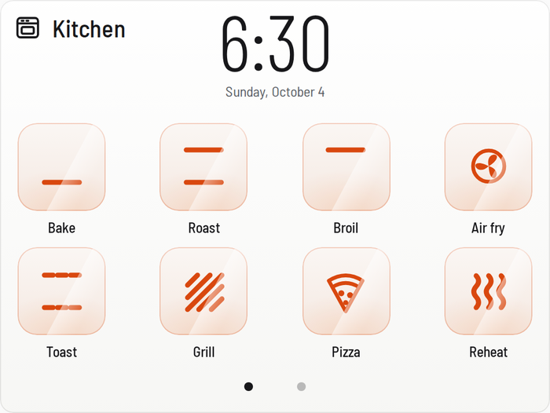</td>
<td width="50%">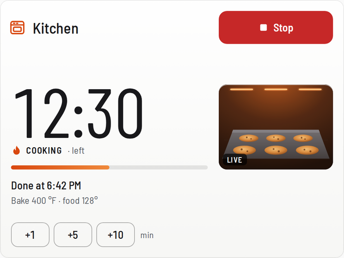</td>
</tr>
</table>

## Help

**The card looks like an older version.** Open the card's Settings and check the version at the
bottom. If it isn't the latest, select **Redownload** in HACS, restart Home Assistant and
hard-refresh the browser tab (Ctrl+Shift+R, or Cmd+Shift+R on a Mac). Also check **Settings ›
Dashboards › Resources** for a `/local/july-oven-card.js` entry left over from a manual copy, and
remove it.

**A grey panel shows for a moment.** That's the loading panel. It appears only if Home Assistant
takes longer than a third of a second to finish loading the dashboard after a refresh.

**The oven won't start from the card.** When the oven refuses, the card says why:

- *Remote start is off on this oven.* On the oven, open **Settings › App permissions** and turn it
  on.
- *Close the oven door*, then try again.
- *There is food or a probe in the oven.* Take it out before preheating.
- *The oven is cleaning*, or *isn't ready yet*. Try again in a moment.

**Stop at target didn't turn the oven off.** The oven can't read another thermometer, so the card
does the stopping. It only works while a card showing that oven is open in a browser.

**The camera says Camera off.** The oven only sends pictures while it heats, unless it runs the
Project July local server, which can wake the camera when you open the window. If the oven is
heating and the window says *Waiting for a picture*, the oven hasn't sent one yet.

**The card says Offline.** Home Assistant hasn't heard from the oven for a while. Check that the
oven is on your network and that the oven's address in the integration's options is still right.
